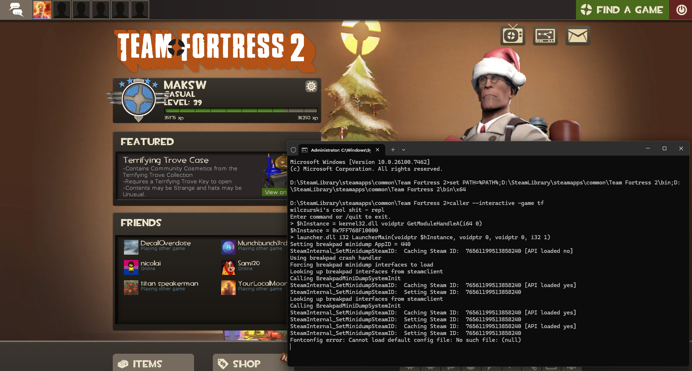
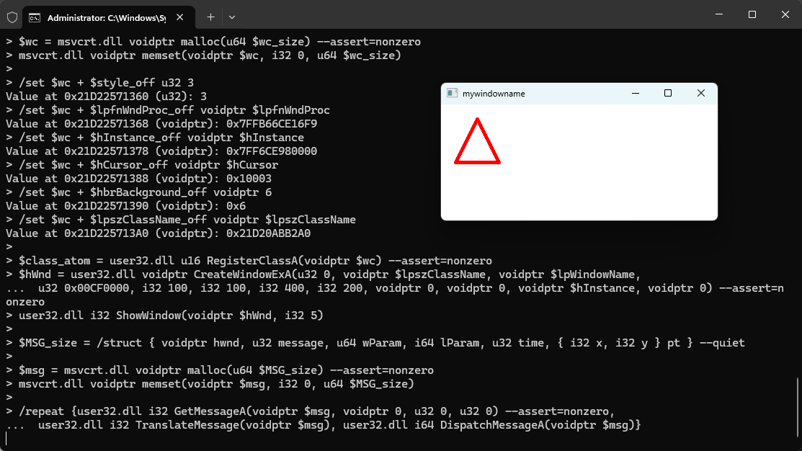
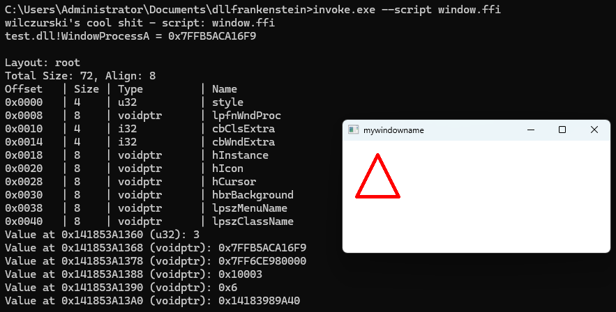
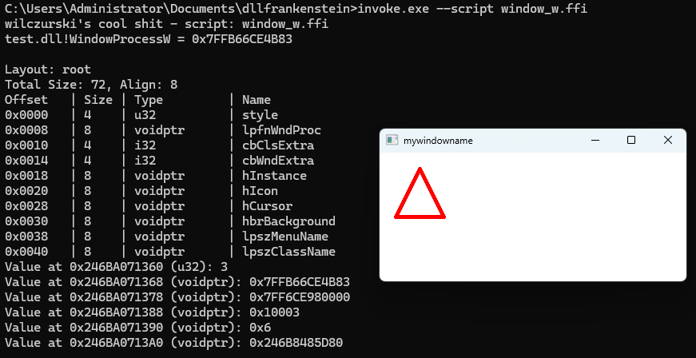
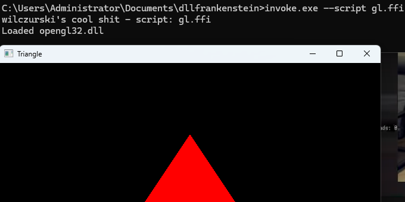
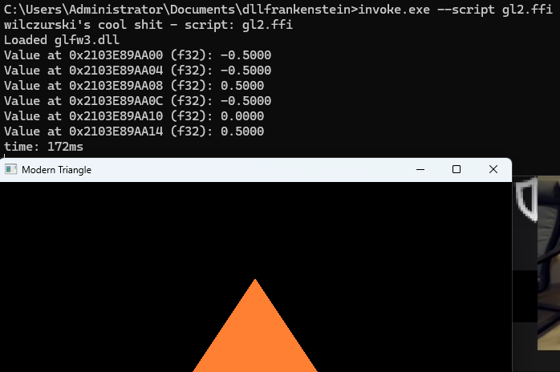
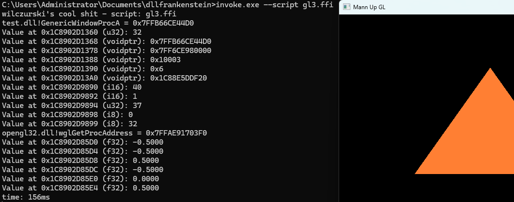
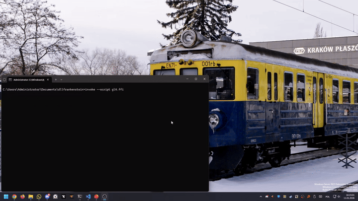

# dllfrankenstein – call any DLL function anytime anywhere, rundll32's evil, competent cousin

A raw, unapologetic bridge between man and machine.  
Manually load DLLs, manipulate memory, and invoke native functions.  
With great power comes great segfaults.  
scary shit

## warning

Lying about signatures may corrupt memory, program state, or cause delayed crashes.

The stack is protected.  
The registers are protected.  
The heap is not.  
Reality is not.  
The ABI is respected. Your arguments are not.

This is a personal systems playground.  
There are no compatibility guarantees.  
Syntax, semantics, and runtime behavior may change at any time.  
If you build on this, you accept breakage as a feature.

## how 2 use it

to build the app:
- `build.bat`

wow, a windows tool uses a windows scripting language for build 👻

to build the test dll:
- `cl /LD /Zi code\test.c /link /debug /out:examples\test.dll user32.lib gdi32.lib legacy_stdio_definitions.lib`

## help string

```
wilczurski's cool shit - ffi
Basic usage: invoke.exe <dll_path> <return_type> <func_name>(<arg_type> <arg_value, ...)
        [--print-result] [--assert[v]=<type>]
    <func_name> can be an ordinal like #<ordinal>
    or: invoke.exe --interactive or invoke.exe --script <script_path>
    <type> can be: zero, nonzero, negative, nonnegative
    assertv reports success/failure where assert exits if failure
    The exception to this is usage in loops, there it is used as an exit condition
    Scripts by default use .ffi, it is not enforced
Usage in interactive/script mode is the same as non-interactive with more features
    except when focused on a DLL, then you don't need to specify <dll_path>
Commands in interactive/script mode:
    To write a comment use ; like in assembly
    /loaddll <path>                     Load and focus a DLL or just focus if loaded
    /freedll <path>                     Unload a DLL
    /set     <addr>     <type>  <value> Store a value at a memory address
    /get     <addr>     <type>          Get a value from a memory address
    /hex     <addr>     [count]         Hex dump memory
    /address <dll_path> <name>          Get a function pointer by name or #ordinal
    /struct  { <type> <name>, ... }     Calculate the offsets and size of a struct
    /struct  { $<name> = <type> <name>, ... } Calculate the offsets and size of a struct and assign offsets
    Both assume default packing and return the size. You can have structs in structs
    /dlls                               List loaded DLLs
    /for     <count>    {<cmd>, ...}    Repeat {} <count> times
    /repeat             {<cmd>, ...}    Repeat {} until assert failure
    /quit                               Exit the program
Variables have no scopes and should not be modified by any callee, for that use malloc
    $<name> = <type> <value>    Set variable value (e.g. $val = i32 10)
    $<name> = <command>         Capture command/function output into variable
    &$<name>                    Address-of: Get the memory pointer to a variable's storage
    *$<name>                    Dereference: Read 64-bit value from the address stored in $<name>
    $i is a reserved variable for loop iterations. It is intentionally not reset on break
    Variables can be used as function arguments, like msvcrt.dll i32 printf(str "%d", i32 $<name>)
    Variables can store arbitrary data, values like '$a = i32 69' or pointers like '$p = voidptr 0x12345678'
Types: i8, i16, i32, i64, u8, u16, u32, u64, f32, f64, str, wstr, voidptr, void
    Or their "proper" version: int8_t, int16_t, int32_t, int64_t, uint8_t, uint16_t, uint32_t, uint64_t, float, double
    str, wstr, voidptr are equivalent to C's narrow null-terminated string (char*), wide string (wchar_t*), pointer (void*)
    In the case of 'str' interpretation is entirely up to the callee (ACP, UTF-8, ASCII, or raw even bytes).
    No validation or conversion is performed
You can pass hex and decimal values. Types are advisory, not enforced. It's your fault when a function reads garbage
SEH exists only to stop instant termination, not to save you. You are saved from null pointers in the built-in commands
Any error is fatal when running a script
```

## examples

<details>
<summary><b>a simple messagebox</b></summary>

```
invoke.exe user32.dll i32 MessageBoxA(voidptr 0, str "hi", str "title", u32 0)
invoke.exe user32.dll i32 MessageBoxW(voidptr 0, wstr "hi", wstr "title", u32 0)
```

</details>

<details>
<summary><b>starting tf2</b></summary>

because tf2 reads from GetCommandLineA and not from lpCmdLine we have to pass parameters
 for LauncherMain in our parameters and a dummy string in LauncherMain.  
idiots.



</details>

<details>
<summary><b>having fun with memory</b></summary>

```
C:\Users\Administrator\Documents\dllfrankenstein>invoke.exe --interactive
wilczurski's cool shit - repl
Enter command or /quit to exit.
> $a = msvcrt.dll voidptr malloc(u64 128) --assert=nonzero
> /set $a i32 67
Value at 0x1A7266E1360 (i32): 67
> /get $a i32
Read 0x1A7266E1360 (i32): 67
> /set $a+4 i32 420
Value at 0x1A7266E1364 (i32): 420
> /hex $a 8
Dump 0x1A7266E1360 (8 bytes):
  0000: 43 00 00 00 A4 01 00 00                          |C.......|
> msvcrt.dll void free(voidptr $a)
> $b = msvcrt.dll voidptr malloc(u64 128) --assert=nonzero
> /set $b str "hello, world!"
Value at 0x1A7266E1360 (str): "hello, world!"
> /get $b str
Read 0x1A7266E1360 (str): "hello, world!"
> /hex $b 128
Dump 0x1A7266E1360 (128 bytes):
  0000: 68 65 6C 6C 6F 2C 20 77 6F 72 6C 64 21 00 00 00  |hello, world!...|
  0010: 72 61 6D 20 46 69 6C 65 73 5C 43 6F 6D 6D 6F 6E  |ram Files\Common|
  0020: 20 46 69 6C 65 73 00 43 6F 6D 6D 6F 6E 50 72 6F  | Files.CommonPro|
  0030: 67 72 61 6D 46 69 6C 65 73 28 78 38 36 29 3D 43  |gramFiles(x86)=C|
  0040: 3A 5C 50 72 6F 67 72 61 6D 20 46 69 6C 65 73 20  |:\Program Files |
  0050: 28 78 38 36 29 5C 43 6F 6D 6D 6F 6E 20 46 69 6C  |(x86)\Common Fil|
  0060: 65 73 00 43 6F 6D 6D 6F 6E 50 72 6F 67 72 61 6D  |es.CommonProgram|
  0070: 57 36 34 33 32 3D 43 3A 5C 50 72 6F 67 72 61 6D  |W6432=C:\Program|
> msvcrt.dll void free(voidptr $b)
> /quit
```

remember to memset your memory kids!

</details>

<details>
<summary><b>assertions</b></summary>

```
C:\Users\Administrator\Documents\dllfrankenstein>invoke.exe --interactive
wilczurski's cool shit - repl
Enter command or /quit to exit.
> test.dll i32 Add(i32 0, i32 0) --print-result --assert=zero
Result: 0
> test.dll i32 Add(i32 9, i32 10) --print-result --assert=nonzero
Result: 19
> test.dll i32 Add(i32 0, i32 0) --print-result --assert=nonzero
Result: 0
Assertion failed for result: 0
> test.dll i32 Add(i32 9, i32 10) --print-result --assert=zero
Result: 19
Assertion failed for result: 19
> /quit
```

</details>

<details>
<summary><b>import by ordinal</b></summary>

```
C:\Users\Administrator\Documents\dllfrankenstein>dumpbin /exports C:\Windows\System32\kernel32.dll | findstr Sleep
       1481  5C8 00031980 Sleep
C:\Users\Administrator\Documents\dllfrankenstein>dumpbin /exports C:\Windows\System32\kernel32.dll | findstr Beep
        117   74 0004F780 Beep
C:\Users\Administrator\Documents\dllfrankenstein>invoke.exe --interactive
wilczurski's cool shit - repl
Enter command or /quit to exit.
> kernel32.dll void #1481(i32 5000)
> kernel32.dll void #117(i32 750, i32 300)
> /quit
```

</details>

<details>
<summary><b>SEH covering up my ass</b></summary>

```
C:\Users\Administrator\Documents\dllfrankenstein>invoke.exe --interactive
wilczurski's cool shit - repl
Enter command or /quit to exit.
> test.dll void AccessViolation()

[!!!] CRASH DETECTED DURING CALL [!!!]
Exception Code: 0xC0000005
Reason: Access Violation
> test.dll void StackOverflow()

[!!!] CRASH DETECTED DURING CALL [!!!]
Exception Code: 0xC00000FD
Reason: Stack Overflow
> test.dll void IllegalInstruction()

[!!!] CRASH DETECTED DURING CALL [!!!]
Exception Code: 0xC000001D
Reason: Illegal Instruction
> test.dll void PrivInstruction()

[!!!] CRASH DETECTED DURING CALL [!!!]
Exception Code: 0xC0000096
Reason: Privileged Instruction
> /quit
```

</details>

<details>
<summary><b>creating a win32 window</b></summary>



</details>

### scripts

<details>
<summary><b>creating a win32 window</b></summary>



</details>

<details>
<summary><b>creating a win32 window using wide strings</b></summary>



</details>

<details>
<summary><b>a simple opengl 1.1 triangle</b></summary>



</details>

<details>
<summary><b>a complex opengl 3.3 triangle</b></summary>



</details>

<details>
<summary><b>a complex opengl 3.3 triangle without glfw to help</b></summary>



</details>

<details>
<summary><b>a complex opengl 3.3 triangle with controls</b></summary>



</details>

<details>
<summary><b>a simple http server</b></summary>


</details>

<details>
<summary><b>a simple MADPCM player</b></summary>

```
C:\Users\Administrator\Documents\dllfrankenstein>invoke --quiet --script audio.ffi
Loading MADPCM file...
Decoding to PCM...
Applying Inverse Mid/Side Transform (M/S -> L/R)...
Format: 48000 Hz, 2 Channels, 11414528 Samples
Playing...
sleeping for 238802 ms
goodbye!
```

</details>

## how 2 contribute

4 spaces, not tabs  
`if (condition) {`  
test your changes  
make a pr

## how 2 contact

- maksw@maksw.pl

## faq

Q: Why make this?  
A: Because `rundll32.exe` is stupid. Everything rundll32 can do, this tool does better and more

Q: What's the use case for it?  
A: Poking random DLLs without writing C. If you need more structure than that, this probably isn’t for you.

Q: Is this safe?  
A: In my experience. If you're careful enough.  

Q: But really?  
A: There's no compiler to warn you.

Q: Can this brick my system?  
A: If you're creative enough.

Q: Can I use this in production?  
A: No warranty.

Q: Why is the syntax like this?  
A: It made sense at 3 AM.

Q: It crashed!  
A: Open an issue. **Describe it well.** “It crashed” is not a report.

Q: Does it support all calling conventions?  
A: Technically.

Q: Are there bugs?  
A: Features in progress.

Q: Can I do pointer math?  
A: Yes.

Q: What is the scale of pointer math?  
A: Bytes. Always.

Q: Does it support variable arguments?  
A: Variadic promotion does not exist. You need to know which type to cast to.

Q: Will you add fancy type parsing?  
A: How about no.
