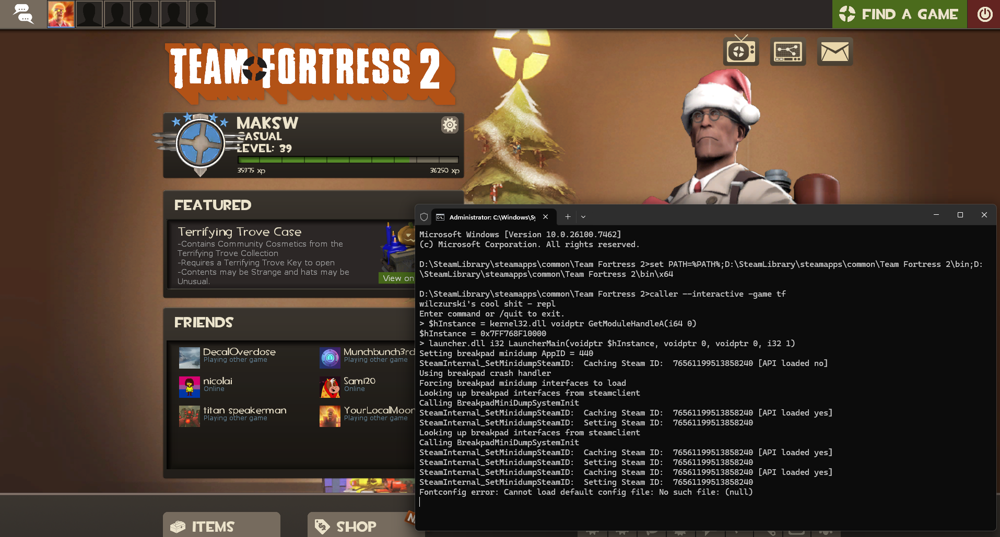
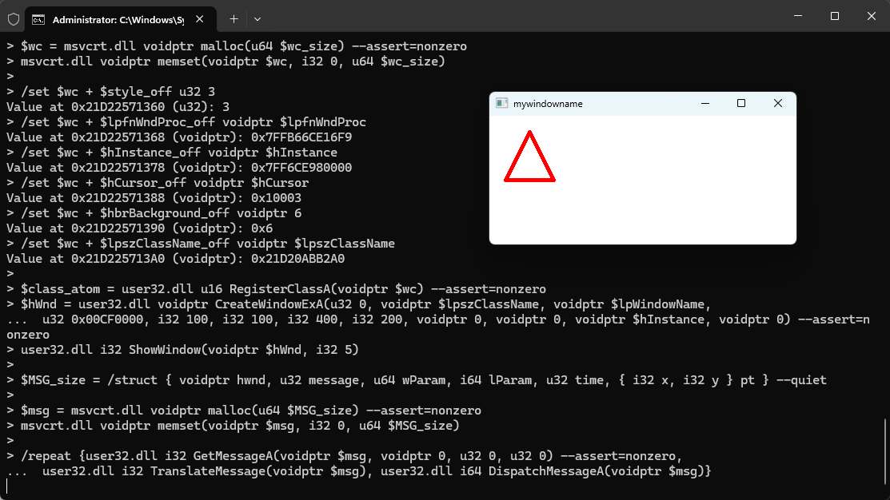
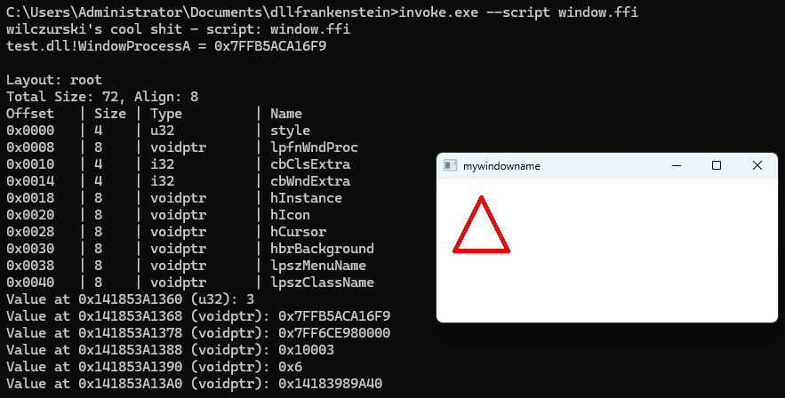
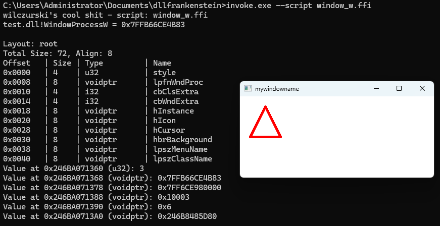
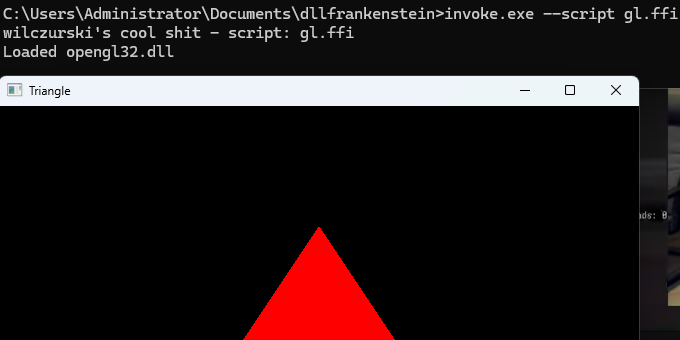
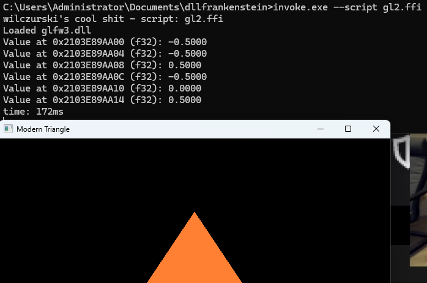
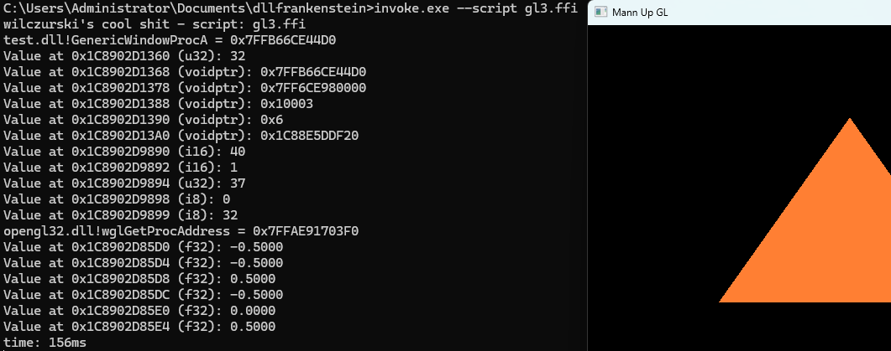
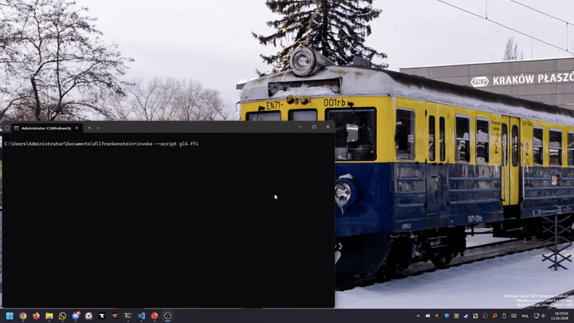

# dllfrankenstein – call any DLL function anytime anywhere, rundll32's evil, competent cousin

A raw, unapologetic bridge between man and machine.  
Manually load DLLs, manipulate memory, and invoke native functions.  
With great power comes great segfaults.  
scary shit

## how 2 use it

to build the app:
- `build.bat`

wow, a windows tool uses a windows scripting language for build 👻

## help string

```
wilczurski's cool shit - ffi

USAGE
  invoke.exe --interactive | -i [--quiet]
  invoke.exe --script <file.ffi> [--quiet]
  invoke.exe --check <file.ffi>
  invoke.exe --eval <source> [--quiet]
  invoke.exe <source...>

OPTIONS
  --quiet - suppress normal result, dump, and list output
  --check <file.ffi> - parse and type-check a script without executing it
  --interactive, -i - start the REPL
  --help, -h, -?, /h, /? - show this reference

SOURCE
  ; comment - comment to end of line
  // comment - comment to end of line
  Semicolons start comments; they are not statement terminators.
  Statements do not require terminators.

TYPES
  i8, i16, i32, i64 - signed integers
  u8, u16, u32, u64 - unsigned integers
  f32, f64 - floating point
  str, wstr - narrow and wide null-terminated string pointers
  ptr - untyped pointer
  void - return type only

VALUES AND VARIABLES
  $x = i32 42
  $x = i32 ($y + 1)
  $p = ptr &$x
  $next = $p + 8
  $bytes = $end - $begin
  $v = i32 *$p
  i32 *$p = $v

  Blocks create variable scopes. Assigning an existing name redefines that variable in
  the scope where it already exists. New names are created in the current scope.
  Scalar variables adopt the value and type of the right-hand side when assigned.
  i32 $x numerically converts $x; i32 *&$x reads the same storage as i32 instead.
  Pointer arithmetic is always in bytes.

FUNCTIONS
  i32 add(i32 $a, i32 $b) {
      return $a + $b
  }

  add(1, 2) - call a previously defined script function
  i32 add(i32 1, i32 2) - call with a caller-provided signature
  i32 SomeExport(i32 1) - call the focused DLL, unless a script function has that name
  user32.dll i32 SomeExport(i32 1) - call a specific DLL
  i32 $fn(i32 1) - call an address stored in a variable
  &add - get the function's address

  Untyped calls require a previously defined script function.
  Script functions take priority over symbols in the focused DLL.
  Redefining a function does not change its memory position.

STRUCTS, UNIONS, ARRAYS
  struct POINT {
      i32 x
      i32 y
  }

  struct PACKED pack(1) {
      u8 tag
      u32 value
  }

  union NUMBER {
      i64 integer
      f64 floating
  }

  struct BUFFER {
      u32 length
      u8 data[256]
  }

  $p = POINT { .x = 10, .y = 20 }
  $x = $p.x
  $p.x = 30
  $b = $buffer.data[4]
  $tmp = struct { i32 x i32 y } { .x = 1, .y = 2 }

  sizeof(POINT) - size of a type in bytes
  sizeof($p) - size of a value in bytes
  alignof(POINT) - alignment of a type
  offsetof(POINT, x) - byte offset of a field; nested paths are allowed

  Named aggregate types must be defined before use.
  Redefining a named aggregate creates a new type definition.
  Aggregate initializer fields are comma-separated; unspecified fields are zeroed.

ARRAYS
  $vertices = f32[6] { -0.5, -0.5, 0.5, -0.5, 0.0, 0.5 }
  $scratch = u8[4096] {} - omitted elements are zeroed
  $vertices[2] = 0.25
  $x = $vertices[2]
  sizeof($vertices) - total byte size of the array
  &$vertices - address of the array storage

  Arrays are fixed-size values with automatic storage for local variables.
  Array initializer elements are comma-separated and converted to the element type.
  [N] is part of the type, so sizeof(f32[6]) and f32[6] *$address are also valid.

CONTROL FLOW
  if ($x) { ... }
  if ($x) { ... } else if ($y) { ... } else { ... }
  while ($x) { ... }
  break
  continue
  return
  return $value
  assert($condition)
  assert($condition, "message")

  if and while bodies require braces. Zero is false; nonzero is true.
  break and continue are valid only inside while.
  return is valid only inside a function.

OPERATORS
  unary - - ! ~ &
  arithmetic - + - * / %
  shifts - << >>
  comparison - == != < <= > >=
  bitwise - & ^ |
  logical - && ||

MEMORY
  $value = i32 *$address - read an i32 from an address
  i32 *$address = 123 - write an i32 to an address
  f32 *($address + 4) = 1.0 - typed memory access may use any scalar address expression
  hex($address, 64) - dump 64 bytes from an address

  The memory access type controls the width and interpretation of the access.
  The address expression is not converted: its raw scalar bits are used as the address.
  Assignment to a typed memory place converts the right-hand side to the place type.
  Pointer arithmetic is always in bytes.

DLLS
  load("foo.dll") - load a DLL and make it focused
  focus("foo.dll") - focus a DLL, loading it if necessary
  free("foo.dll") - unload a DLL
  dlls() - list loaded DLLs; * marks the focused DLL
  address("foo.dll", "Symbol") - get an exported symbol address
  address("foo.dll", "#123") - get an export by ordinal
  quit() - exit the interpreter or REPL
```

## examples

<details>
<summary><b>a simple messagebox</b></summary>

```
invoke.exe user32.dll i32 MessageBoxA(voidptr 0, str "hi", str "title", u32 0)
invoke.exe user32.dll i32 MessageBoxW(voidptr 0, wstr "hi", wstr "title", u32 0)
```

</details>

<details>
<summary><b>starting tf2</b></summary>

because tf2 reads from GetCommandLineA and not from lpCmdLine we have to pass parameters
 for LauncherMain in our parameters and a dummy string in LauncherMain.  
idiots.



</details>

<details>
<summary><b>having fun with memory</b></summary>

```
C:\Users\Administrator\Documents\dllfrankenstein>invoke.exe --interactive
wilczurski's cool shit - repl
Enter command or /quit to exit.
> $a = msvcrt.dll voidptr malloc(u64 128) --assert=nonzero
> /set $a i32 67
Value at 0x1A7266E1360 (i32): 67
> /get $a i32
Read 0x1A7266E1360 (i32): 67
> /set $a+4 i32 420
Value at 0x1A7266E1364 (i32): 420
> /hex $a 8
Dump 0x1A7266E1360 (8 bytes):
  0000: 43 00 00 00 A4 01 00 00                          |C.......|
> msvcrt.dll void free(voidptr $a)
> $b = msvcrt.dll voidptr malloc(u64 128) --assert=nonzero
> /set $b str "hello, world!"
Value at 0x1A7266E1360 (str): "hello, world!"
> /get $b str
Read 0x1A7266E1360 (str): "hello, world!"
> /hex $b 128
Dump 0x1A7266E1360 (128 bytes):
  0000: 68 65 6C 6C 6F 2C 20 77 6F 72 6C 64 21 00 00 00  |hello, world!...|
  0010: 72 61 6D 20 46 69 6C 65 73 5C 43 6F 6D 6D 6F 6E  |ram Files\Common|
  0020: 20 46 69 6C 65 73 00 43 6F 6D 6D 6F 6E 50 72 6F  | Files.CommonPro|
  0030: 67 72 61 6D 46 69 6C 65 73 28 78 38 36 29 3D 43  |gramFiles(x86)=C|
  0040: 3A 5C 50 72 6F 67 72 61 6D 20 46 69 6C 65 73 20  |:\Program Files |
  0050: 28 78 38 36 29 5C 43 6F 6D 6D 6F 6E 20 46 69 6C  |(x86)\Common Fil|
  0060: 65 73 00 43 6F 6D 6D 6F 6E 50 72 6F 67 72 61 6D  |es.CommonProgram|
  0070: 57 36 34 33 32 3D 43 3A 5C 50 72 6F 67 72 61 6D  |W6432=C:\Program|
> msvcrt.dll void free(voidptr $b)
> /quit
```

remember to memset your memory kids!

</details>

<details>
<summary><b>assertions</b></summary>

```
C:\Users\Administrator\Documents\dllfrankenstein>invoke.exe --interactive
wilczurski's cool shit - repl
Enter command or /quit to exit.
> test.dll i32 Add(i32 0, i32 0) --print-result --assert=zero
Result: 0
> test.dll i32 Add(i32 9, i32 10) --print-result --assert=nonzero
Result: 19
> test.dll i32 Add(i32 0, i32 0) --print-result --assert=nonzero
Result: 0
Assertion failed for result: 0
> test.dll i32 Add(i32 9, i32 10) --print-result --assert=zero
Result: 19
Assertion failed for result: 19
> /quit
```

</details>

<details>
<summary><b>import by ordinal</b></summary>

```
C:\Users\Administrator\Documents\dllfrankenstein>dumpbin /exports C:\Windows\System32\kernel32.dll | findstr Sleep
       1481  5C8 00031980 Sleep
C:\Users\Administrator\Documents\dllfrankenstein>dumpbin /exports C:\Windows\System32\kernel32.dll | findstr Beep
        117   74 0004F780 Beep
C:\Users\Administrator\Documents\dllfrankenstein>invoke.exe --interactive
wilczurski's cool shit - repl
Enter command or /quit to exit.
> kernel32.dll void #1481(i32 5000)
> kernel32.dll void #117(i32 750, i32 300)
> /quit
```

</details>

<details>
<summary><b>SEH covering up my ass</b></summary>

```
C:\Users\Administrator\Documents\dllfrankenstein>invoke.exe --interactive
wilczurski's cool shit - repl
Enter command or /quit to exit.
> test.dll void AccessViolation()

[!!!] CRASH DETECTED DURING CALL [!!!]
Exception Code: 0xC0000005
Reason: Access Violation
> test.dll void StackOverflow()

[!!!] CRASH DETECTED DURING CALL [!!!]
Exception Code: 0xC00000FD
Reason: Stack Overflow
> test.dll void IllegalInstruction()

[!!!] CRASH DETECTED DURING CALL [!!!]
Exception Code: 0xC000001D
Reason: Illegal Instruction
> test.dll void PrivInstruction()

[!!!] CRASH DETECTED DURING CALL [!!!]
Exception Code: 0xC0000096
Reason: Privileged Instruction
> /quit
```

</details>

<details>
<summary><b>creating a win32 window</b></summary>



</details>

### scripts

<details>
<summary><b>creating a win32 window</b></summary>



</details>

<details>
<summary><b>creating a win32 window using wide strings</b></summary>



</details>

<details>
<summary><b>a simple opengl 1.1 triangle</b></summary>



</details>

The following examples are intentionally hostile to the tool's design.
They exist to show limits, not best practices.

<details>
<summary><b>a complex opengl 3.3 triangle</b></summary>



</details>

<details>
<summary><b>a complex opengl 3.3 triangle without glfw to help</b></summary>



</details>

<details>
<summary><b>a complex opengl 3.3 triangle with controls</b></summary>



</details>

<details>
<summary><b>an http server</b></summary>


</details>

## how 2 contribute

4 spaces, not tabs  
k&r braces  
pointer belongs to the type  
test your changes  
make a pr

## how 2 contact

- maksw@maksw.pl

## faq

Q: Why make this?  
A: Because `rundll32.exe` is stupid. Everything rundll32 can do, this tool does better and more

Q: What's the use case for it?  
A: Poking random DLLs without writing C.

Q: Is this safe?  
A: In my experience.  

Q: Can this brick my system?  
A: If you're creative enough.

Q: Can I use this in production?  
A: No warranty.

Q: Why is the syntax like this?  
A: It made sense at 3 AM.

Q: What inspired the syntax?  
A: Alcohol.

Q: It crashed!  
A: Probably your fault.

Q: Does it support all calling conventions?  
A: Technically.

Q: Are there bugs?  
A: Features in progress.

Q: Can I do pointer math?  
A: Haven't you read the help string?

Q: Does it support variable arguments?  
A: Variadic argument promotion does not exist. You need to know which type to cast to.

Q: Will you add fancy type parsing?  
A: Let's circle back on this in Q4.
